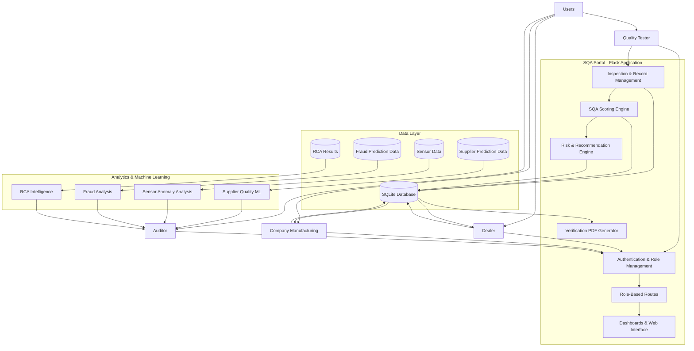
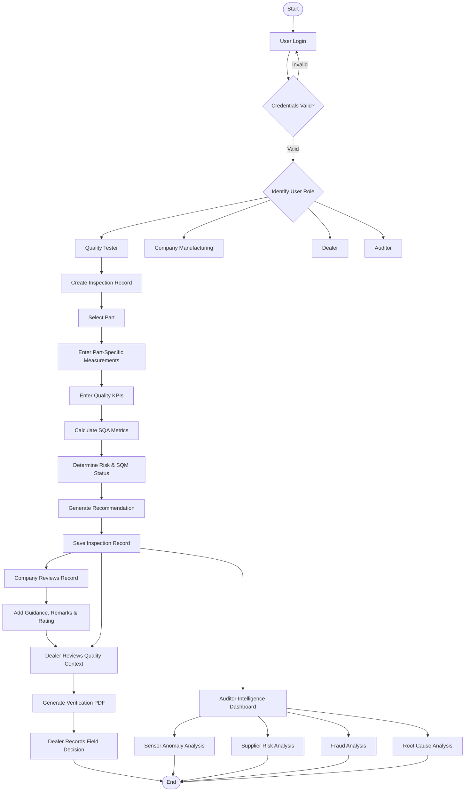
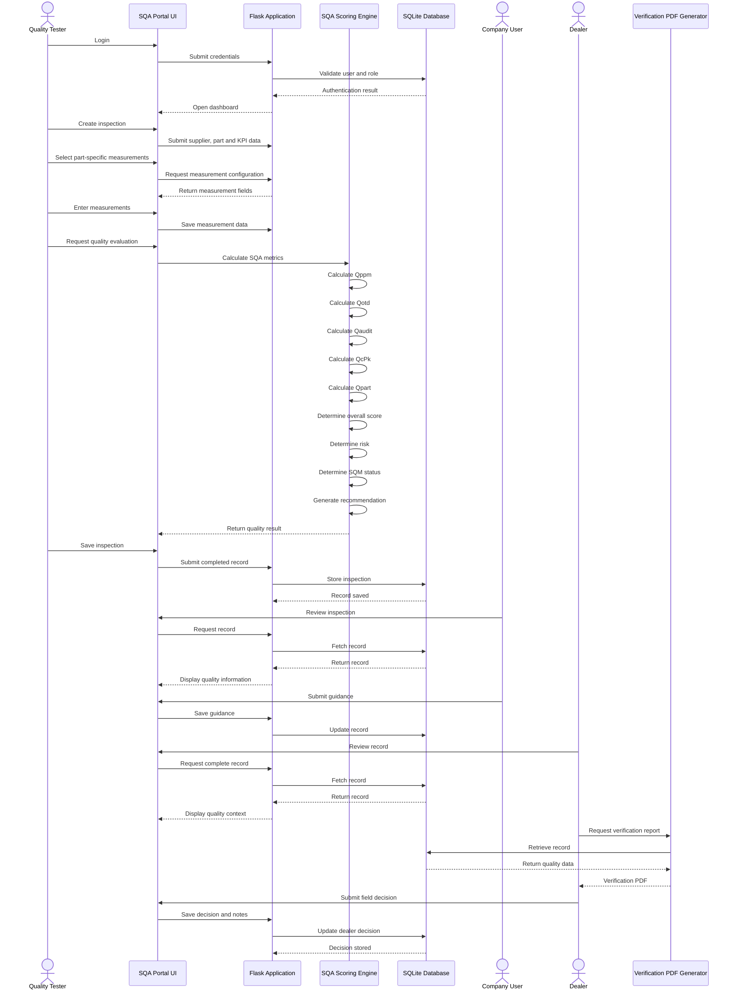
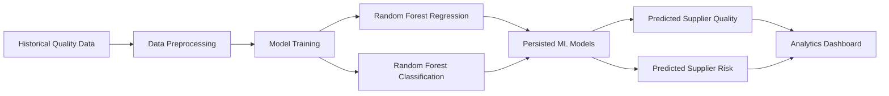

# SQA Portal

### Software Quality Assurance & Manufacturing Intelligence Platform

> **From quality inspection to intelligent decision-making.**

## The Problem — Where the Loss Begins

In manufacturing, quality loss rarely begins at the moment a product fails.

It usually begins much earlier.

A supplier may slowly decline in quality without immediately crossing a critical threshold. A component may pass a routine inspection while showing early signs of deterioration. A defective part may reach the dealer before the underlying quality issue is fully understood. An auditor may eventually identify the problem, but only after the organization has already experienced rework, operational disruption, financial loss, or customer impact.

The challenge, therefore, is not simply:

> **"How do we inspect a product?"**

The more important question is:

> **"How do we identify quality risk early enough to make a better decision?"**

That question became the foundation of **SQA Portal**.

---

## The Vision

SQA Portal was built with a simple vision:

> **Quality should not be treated as a final checkpoint. It should be treated as a continuous decision system.**

A modern quality process should connect the entire journey — from the first inspection measurement to the final operational decision.

The vision is:

```text
Quality Evidence
       ↓
Measurement
       ↓
Quality Evaluation
       ↓
Risk Identification
       ↓
Recommendation
       ↓
Human Review
       ↓
Operational Decision
       ↓
Verification
       ↓
Audit Intelligence
       ↓
Prevention
```

Instead of allowing quality information to remain isolated inside inspection forms or spreadsheets, SQA Portal brings the different stages together into one platform.

---

# What Is SQA Portal?

**SQA Portal** is a role-based Software Quality Assurance and Manufacturing Intelligence platform designed to connect **inspection, quality scoring, supplier risk, predictive analytics, business decisions, dealer actions, and auditing**.

The platform is built around four primary roles:

| Role                      | Responsibility                                                               |
| ------------------------- | ---------------------------------------------------------------------------- |
| **Quality Tester**        | Captures inspection information and part-specific quality measurements       |
| **Company Manufacturing** | Reviews quality information and provides manufacturing guidance              |
| **Dealer**                | Reviews supplier and product quality and records the actual field decision   |
| **Auditor**               | Investigates supplier risk, sensor anomalies, fraud signals, and root causes |

Each role interacts with the same quality ecosystem from a different perspective.

This creates a complete chain:

```text
Tester
  ↓
Quality Evidence
  ↓
SQA Evaluation
  ↓
Company Review
  ↓
Dealer Decision
  ↓
Verification
  ↓
Auditor Intelligence
```

---

# The Core Idea

The central idea behind SQA Portal is simple:

> **The value of quality data is not in collecting it. The value is in what the organization can decide because of it.**

A traditional quality system may answer:

**What was inspected?**

A better system can answer:

**What was the quality score?**

A predictive system can answer:

**What is likely to happen?**

But a decision-oriented quality system must go one step further:

**What should we do about it?**

SQA Portal is designed around this progression:

```text
DATA
  ↓
EVIDENCE
  ↓
INTELLIGENCE
  ↓
RISK
  ↓
RECOMMENDATION
  ↓
HUMAN DECISION
  ↓
AUDITABLE OUTCOME
```

---

# Why SQA Portal Was Designed This Way

The project was intentionally designed not to become another CRUD application where a user enters data, clicks **Save**, and receives a row in a table.

Quality decisions involve more than data storage.

They involve:

* Physical measurements
* Supplier performance
* Process capability
* Delivery performance
* Audit results
* Criticality
* Risk
* Business context
* Human judgment
* Historical patterns
* Root causes

SQA Portal therefore separates the quality journey into multiple responsibilities.

The **Quality Tester** creates the evidence.

The **SQA engine** evaluates that evidence.

The **Company Manufacturing team** adds operational context.

The **Dealer** makes the field decision.

The **Auditor** investigates broader patterns.

This creates a system where technology supports the people responsible for quality rather than attempting to replace them.

---

# Quality Starts With the Inspection

The process begins with the **Quality Tester**.

The tester captures the information required to understand the quality condition of a supplier and component.

This includes information such as:

* Plant
* Vehicle model
* Supplier
* Part
* Quantity inspected
* Quantity defective
* PPM
* On-Time Delivery
* Audit score
* CPK
* Criticality
* Minimum required SQM
* Part-specific measurements

The important design decision is that the system does not treat every component as identical.

Different components have different physical characteristics and different failure modes.

---

# Part-Specific Quality Measurement

SQA Portal provides specialized measurement workflows for different types of components.

The current system includes components such as:

* V-Belt
* Radiator Hose
* Air Filter
* Brake Chamber
* Relay Valve
* Wheel Speed Sensor
* Wheel Bearing
* U-Joint
* Fuel/Water Separator

For example, a **Wheel Bearing** can be evaluated using measurements such as:

```text
Temperature Rise
Vibration
Bearing Play
```

while a **Brake Chamber** can be evaluated using characteristics such as:

```text
Leak Rate
Pushrod Stroke
Response Lag
```

This approach makes the system closer to a real manufacturing quality process.

Instead of asking:

> **"Is the part good?"**

the system asks:

> **"Which characteristics of this particular part determine whether it is good?"**

---

# From Measurements to Quality Intelligence

Once the inspection information has been captured, the portal transforms the raw measurements into meaningful quality indicators.

The inspection workflow evaluates dimensions including:

```text
PPM
OTD
Audit Performance
CPK
Part-Specific Quality
Criticality
SQM Requirement
```

These contribute to an explainable SQA evaluation.

The system exposes individual quality components such as:

```text
Qppm
Qotd
Qaudit
QcPk
Qpart
Rule Score
Overall SQA Score
```

This is an important principle of the platform:

> **A quality score should be explainable.**

A reviewer should not simply see a number such as `82.4` and be expected to trust it.

They should be able to understand the factors that contributed to that result.

---

# Rules and Machine Learning — Different Jobs, One System

SQA Portal does not treat machine learning as a replacement for the quality process.

Instead, the system uses two complementary forms of intelligence.

### Explainable Quality Rules

The inspection workflow uses quality calculations and rule-based logic to evaluate the current inspection.

This provides transparency.

```text
Inspection Data
      ↓
Quality Metrics
      ↓
SQA Evaluation
      ↓
Risk / SQM
      ↓
Recommendation
```

### Machine Learning

Machine learning is used for predictive and analytical intelligence, particularly around supplier quality and risk.

The project includes machine-learning workflows using techniques such as Random Forest regression and classification, with preprocessing and persisted models.

This provides a second perspective:

```text
Historical Data
      ↓
Machine Learning
      ↓
Prediction
      ↓
Supplier Intelligence
```

The distinction is deliberate:

> **Rules explain the present. Machine learning helps anticipate the future. Humans make the decision.**

---

# From Risk to Recommendation

A score by itself is not enough.

The system therefore converts quality evaluation into a risk-oriented outcome.

The result can include:

* Overall SQA score
* Risk classification
* SQM status
* System recommendation

The recommendation provides a practical next step rather than leaving the user with a collection of disconnected numbers.

This creates the transition:

```text
Measurement
     ↓
Score
     ↓
Risk
     ↓
Recommendation
     ↓
Action
```

---

# The Company Perspective

Quality does not exist independently of manufacturing.

Once a quality record has been created, the **Company Manufacturing** role can review the result and provide additional context.

The company can provide:

* Product usage guidance
* Manufacturing remarks
* Product rating

This creates an important bridge between technical quality evaluation and operational knowledge.

The system therefore separates:

**What the inspection says**

from:

**What manufacturing recommends**

That distinction becomes important when the record reaches the dealer.

---

# The Dealer Perspective — From Data to Decision

The dealer is not simply another viewer.

The dealer is where the quality information becomes an operational decision.

A dealer can review the complete context of a quality record, including:

* Supplier details
* Part details
* Quality measurements
* SQA score
* Risk level
* SQM status
* System recommendation
* Company guidance
* Company remarks
* Verification information

The dealer can then record the actual field decision.

Possible decisions include:

```text
Use
Conditional Use
Do Not Use
Need Retest
```

The dealer can also provide decision notes.

This creates one of the most important distinctions in the platform:

```text
System Recommendation
        ↓
Human Review
        ↓
Actual Dealer Decision
```

The system assists the decision.

**The human owns the decision.**

---

# Verification

Important quality decisions should not exist only inside a web dashboard.

SQA Portal therefore includes a verification workflow that can generate a PDF representation of the quality record and its relevant information.

This provides a more formal artifact that can be reviewed when required.

The principle is simple:

> **If a quality decision matters, the evidence behind that decision should remain reviewable.**

---

# The Auditor Perspective

The Auditor operates at a different level from the tester, company, and dealer.

The tester asks:

> **"What is the quality of this component?"**

The dealer asks:

> **"Should I use this component?"**

The auditor asks:

> **"What is happening across the quality ecosystem?"**

The Auditor dashboard brings together multiple analytical perspectives.

### Supplier Risk

Which suppliers are showing higher levels of predicted risk?

### Sensor Intelligence

Are there abnormal sensor patterns that require investigation?

### Fraud Analysis

Are there claims or records showing suspicious prediction signals?

### Root Cause Analysis

Why are quality problems happening, and what underlying causes should be investigated?

This changes the auditor's role from simply reviewing records to **investigating patterns**.

---

# Four Questions for the Auditor

The Auditor workflow can be understood through four questions:

### 1. Is something behaving abnormally?

**Sensor Intelligence**

### 2. Which suppliers require attention?

**Supplier Risk**

### 3. Could a claim be suspicious?

**Fraud Analysis**

### 4. Why did the problem happen?

**Root Cause Analysis**

Together, these create a broader quality investigation framework.

---

# The Complete Quality Journey

SQA Portal ultimately connects the complete lifecycle:

```text
Inspection
    ↓
Part-Specific Measurement
    ↓
SQA Evaluation
    ↓
Risk Assessment
    ↓
Recommendation
    ↓
Company Guidance
    ↓
Dealer Review
    ↓
Dealer Decision
    ↓
Verification
    ↓
Audit Intelligence
    ↓
Root Cause
    ↓
Preventive Action
```

This is the heart of the project.

The system does not consider the quality record complete simply because the inspection has been submitted.

The real objective is to move from:

> **Detection**

to:

> **Understanding**

and finally to:

> **Prevention.**

---

# The Bigger Vision

The long-term vision of SQA Portal is to move organizations through the following progression:

```text
Reactive Quality
      ↓
Measured Quality
      ↓
Predictive Quality
      ↓
Preventive Quality
      ↓
Continuous Quality Intelligence
```

A quality system should not only tell an organization that something went wrong.

It should help the organization understand:

* What happened
* Where it happened
* Why it happened
* How serious it is
* What could happen next
* What action should be considered
* What can be done to prevent recurrence

That is the direction SQA Portal is designed to support.

---

# What Makes SQA Portal Different?

SQA Portal brings together several concepts that are often separated across different systems.

### Quality Inspection

Capture structured supplier and component information.

### Part-Specific Measurement

Evaluate components using characteristics relevant to their physical behavior.

### Explainable SQA Evaluation

Break quality assessment into understandable components.

### Predictive Intelligence

Use machine learning to provide supplier quality and risk insights.

### Business Context

Allow manufacturing teams to provide operational guidance.

### Dealer Decision-Making

Capture the actual field decision rather than only displaying a system recommendation.

### Verification

Provide a formal representation of important quality records.

### Audit Intelligence

Connect supplier risk, sensor anomalies, fraud analysis and RCA.

The result is not just a database of inspections.

It is a **quality decision ecosystem**.

---

# Technology

The project is built using:

* **Python**
* **Flask**
* **SQLite**
* **Pandas**
* **NumPy**
* **Scikit-learn**
* **Joblib**
* **Matplotlib**
* **ReportLab**
* **HTML / CSS / JavaScript**

---

# The Final Thought

SQA Portal began with a simple realization:

> **Quality losses are often discovered after they have already become expensive.**

The solution is not simply to collect more data.

The solution is to make that data useful.

Capture the right evidence.

Measure the right characteristics.

Evaluate quality transparently.

Identify risk early.

Provide meaningful recommendations.

Bring manufacturing knowledge into the process.

Give dealers the information required to make responsible decisions.

Preserve those decisions through verification.

And give auditors the intelligence required to understand the larger patterns behind individual quality events.

That is the purpose of SQA Portal.

It connects **quality inspection, explainable evaluation, predictive intelligence, business guidance, human decision-making, verification, and audit analysis** into one continuous quality journey.

The ultimate goal is simple:

> **Don't wait for quality failures to become losses. Detect the signals earlier, understand the risk, make better decisions, and use every quality event as an opportunity to prevent the next one.**

# System Architecture

SQA Portal follows a decision-oriented architecture. The platform
connects users, the Flask application, the quality evaluation layer,
the database, and the machine-learning and analytics components.


## Architecture Explained

The architecture is divided into five major areas.

### 1. Users

The platform has four primary roles: Quality Tester, Company Manufacturing,
Dealer, and Auditor.

Each role interacts with the system according to its responsibility.

### 2. Flask Application

The Flask application acts as the central orchestration layer.

It manages authentication, role-based access, inspection records,
quality calculations, recommendations, dashboards, and verification
reports.

### 3. Quality Intelligence

The Quality Tester workflow sends inspection information through the
SQA scoring engine.

The system evaluates PPM, OTD, audit performance, CPK, part-specific
quality and other quality conditions before producing an overall
quality result, risk status and recommendation.

### 4. Data Layer

SQLite stores the operational portal records, while analytical datasets
support the supplier, sensor, fraud and RCA intelligence workflows.

### 5. Analytics and Machine Learning

The analytical layer provides broader intelligence for supplier risk,
sensor anomalies, fraud analysis and root-cause investigation.

The important architectural distinction is that the rule-based SQA
engine provides explainable inspection evaluation, while machine
learning supports predictive and analytical intelligence.

# Activity Diagram

The activity flow describes how a quality record moves through SQA
Portal, from authentication and inspection to company review, dealer
decision and auditor analysis.



## Activity Flow Explained

The workflow begins with authentication. Once the user is identified,
the system provides access to the workflow associated with their role.

The Quality Tester creates an inspection record, selects the relevant
component and enters the measurements specific to that component.

The system then evaluates the quality indicators and produces the
SQA result, risk classification, SQM status and recommendation.

The resulting record becomes available for Company Manufacturing and
Dealer review.

Company Manufacturing can add usage guidance, remarks and product
rating. The Dealer can then review the complete quality context and
record the actual field decision.

In parallel, the Auditor can investigate the wider quality ecosystem
through supplier risk, sensor anomalies, fraud analysis and root-cause
intelligence.

# Sequence Diagram

The sequence diagram shows the communication between the users and
the major SQA Portal components during a typical inspection-to-decision
workflow.



## Sequence Flow Explained

The sequence begins when the Quality Tester authenticates with the
portal.

After authentication, the tester creates an inspection and submits
supplier, part and quality information.

For components with specialized measurements, the application provides
the appropriate measurement fields.

The quality information is then passed to the SQA scoring logic.
The scoring engine calculates the individual quality dimensions,
determines the overall result, evaluates risk and generates a
recommendation.

The completed record is persisted in SQLite.

Company Manufacturing can subsequently retrieve the record and add
manufacturing guidance.

The Dealer retrieves the same record together with the additional
company context. The Dealer can request a verification report and
finally records the actual field decision.

This sequence demonstrates that the quality record is not simply
created and stored. It moves through multiple actors before becoming
a complete quality decision.

# Machine Learning & Analytics Architecture

The machine-learning layer complements the explainable SQA scoring
workflow rather than replacing it.



## How Rules and ML Work Together

The SQA Portal uses two complementary approaches.

### Rule-Based Quality Evaluation

The inspection workflow uses explicit quality calculations and business
rules.

This makes the current inspection result explainable.

```text
Inspection Data
      ↓
Quality Metrics
      ↓
SQA Evaluation
      ↓
Risk / SQM
      ↓
Recommendation


